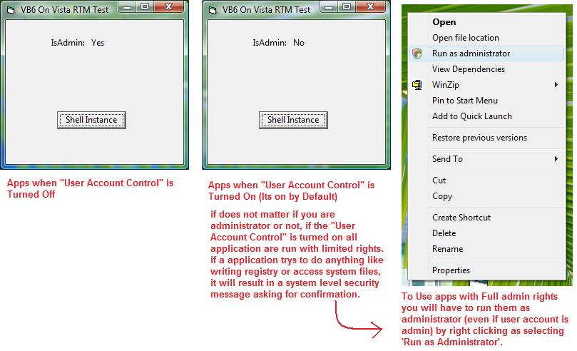



## VB6 SP6 on Windows Vista RTM Test Results \(Update 2\)

### Description

VB6 SP6 Test on Windows Vista RTM Build 6000. See zip file for sample code and article.

and Dont forget to Vote...
 
### More Info
 

             |
---                |---
**Submitted On**   |2007-01-12 23:16:58
**By**             |[Abhishek\.NET](https://github.com/Planet-Source-Code/PSCIndex/blob/master/ByAuthor/abhishek-net.md)
**Level**          |Beginner
**User Rating**    |4.9 (39 globes from 8 users)
**Compatibility**  |VB 4\.0 \(32\-bit\), VB 5\.0, VB 6\.0
**Category**       |[Coding Standards](https://github.com/Planet-Source-Code/PSCIndex/blob/master/ByCategory/coding-standards__1-43.md)
**World**          |[Visual Basic](https://github.com/Planet-Source-Code/PSCIndex/blob/master/ByWorld/visual-basic.md)
**Archive File**   |[VB6\_SP6\_on2042361132007\.zip](https://github.com/Planet-Source-Code/abhishek-net-vb6-sp6-on-windows-vista-rtm-test-results-update-2__1-67610/archive/master.zip)

